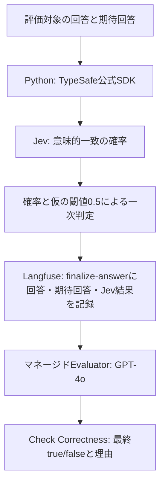

# Jev + Langfuse Trial

Jevで回答の意味的一致を一次判定し、その結果を参考情報としてLangfuseのマネージドEvaluator（GPT-4o）に渡し、最終判定するPythonプロジェクトです。
固定の長文ペアに加え、Jevあり・なしを比較する10件の合成検証データを用意しています。これは接続と判定傾向を確認するための小規模な校正用データであり、精度の一般的な評価には使いません。

## 構成と評価基準



評価する「正確性」は、期待回答の重要な意味・事実・制約・結論を、実際の回答が矛盾なく保持しているかです。
言い換えや形式の違いは許容し、重要な情報の欠落・矛盾・根拠のない主張などは不一致とします。

- **Jev**: TypeSafe公式Python SDK `typesafe-sdk`で直接接続します。Vercel AI Gatewayは使用しません。
- **一次判定**: Noulが返す意味的一致の確率を保存し、0.5以上をtrueに変換します。0.5は未校正の仮値です。確率は部分正答の点数ではありません。
- **最終判定**: GPT-4oが元の回答と期待回答を比較します。Jevの結果は参考情報であり、その判定を変更できます。Jevへの賛否も理由に含めます。
- **実行対象**: 今回はJevのtrue/falseにかかわらず全件を最終評価に渡します。不確実なケースだけを送る分岐は実装していません。

最終評価はLangfuse側で非同期に実行されます。Pythonのコマンド終了は、最終評価の完了を意味しません。
Jevが失敗した場合は最終評価用Observationを作成しません。

## 環境構築

Python 3.14以上、uv、起動済みのLangfuseが必要です。

```bash
uv sync --locked
```

初回のみ`.env.example`を`.env`にコピーし、以下を設定します。設定済みの`.env`は上書きしないでください。

| 環境変数 | 用途 |
| --- | --- |
| `LANGFUSE_BASE_URL` | Langfuse接続先（例: `http://localhost:3000`） |
| `LANGFUSE_PUBLIC_KEY` | Langfuseプロジェクトの公開キー |
| `LANGFUSE_SECRET_KEY` | Langfuseプロジェクトの秘密キー |
| `TYPESAFE_API_KEY` | TypeSafeのAPIキー |

OpenAIのAPIキーはLangfuseの **Settings → LLM Connections** に登録します。
PythonからGPT-4oを直接呼ぶ構成ではありません。キーをGitやREADMEに記載しないでください。

導入済みのツールは次のとおりです。

- Langfuse SDK、python-dotenv、TypeSafe SDK（接続確認時: `typesafe-sdk 0.7.0`）
- Langfuse CLI（接続確認時: `@langfuse/cli 1.2.4`、`~/.local/bin/langfuse`）
- Langfuseスキル: `.agents/skills/langfuse/`

CLIを別の環境にも導入する場合:

```bash
npm install --global @langfuse/cli
langfuse --version
```

## 実行

### 二段階評価

```bash
uv run python -m src.jev_experiment
```

現在の入力は[data/long_semantic_match.json](data/long_semantic_match.json)の長文ペアです。
店名・営業時間・定休日・予約条件・キャンセル期限・駐車場の情報を、意味を維持しつつ言い換えています。

同じペアを3回評価する場合:

```bash
uv run python -m src.jev_experiment --repeat 3
```

各回を別プロセスで実行し、`batch_id`・`run_index`をmetadataに記録します。
実行ごとのトレースIDはGit管理対象外の`results/`にも保存します。
最終判定は非同期のため、コマンド終了後にLangfuseで確認してください。
[3回の結果と分析](docs/long-answer-three-runs.md)を参照してください。

Jevと最終Evaluatorは、評価対象の回答と期待回答を基準に比較します。質問文は判定用プロンプトには渡していません。
毎回Jevを1回呼び出し、新しいトレースを作成します。有効な評価ルールがある場合はGPT-4oも呼ばれるため、両プロバイダーのAPI利用料が発生します。
Jevのタイムアウトは30秒、自動再試行は無効です。

コマンドは一次判定、トレースID、確認URL、最終評価対象Observation IDを表示します。
最終結果は確認URLの`finalize-answer`に付いた`Check Correctness`スコアで確認します。

### Jevなしの対照評価

```bash
uv run python -m src.no_jev_experiment --repeat 3
```

同じ長文ペアをGPT-4oだけで評価します。Jevの呼び出し・一次判定の受け渡しはありません。
`Check Correctness Without Jev`と専用ルールを作成済みで、`finalize-answer-without-jev`だけを対象にします。
意味的一致の基準は共通で、Jevの情報とそれを参照する指示を除去しています。
設定は`config/langfuse/evaluator-without-jev.json`と`config/langfuse/rule-without-jev.json`です。
Jevありの設定を変更せず、両条件を別々に再実行できます。

今回、Jevあり・なし各3回ともtrueでした。これは同じ1ペアの反復結果です。
[比較結果と判定理由](docs/without-jev-three-runs.md)に条件、限界、トレースURLを記載しています。

### 10件の比較ベンチマーク

```bash
uv run python -m src.semantic_equivalence_benchmark --condition both
```

[data/semantic_equivalence_v0.json](data/semantic_equivalence_v0.json)の10件を、JevありとJevなしの両方で1回ずつ評価します。各ケースの`expected_match`は人手で付けた比較用の正解ラベルです。LangfuseのEvaluatorに渡す変数には含めず、Observationのmetadataにだけ保存します。

Jevありでは`finalize-answer`を`Check Correctness`が、Jevなしでは`finalize-answer-without-jev`を`Check Correctness Without Jev`が評価します。前者にだけ`jev_result`を渡します。したがって同じ回答・期待回答に対する、Jev情報の有無を比較できます。

2026-09-19の実行では、3系統（Jev、JevありGPT-4o、JevなしGPT-4o）は10件中9件で人手ラベルと一致し、両GPT-4o条件の最終true/falseは10件すべて同一でした。詳細、全トレース、解釈上の限界は[10件ベンチマークの結果](docs/semantic-equivalence-v0-benchmark.md)を参照してください。

### 接続確認のみ

```bash
# Langfuseへ固定の入出力を1件送信
uv run python -m src.experiment

# Jevへ簡易プロンプトで1件送信（Langfuseへの記録なし）
uv run python -m src.jev_connection_check
```

`src.experiment`自体はモデルを呼びません。現在の最終評価ルールは`finalize-answer`のみを対象とするため、この接続確認は対象外です。

## Langfuseに保存する内容

```text
evaluate-with-jev (SPAN)
├── judge-semantic-equivalence (GENERATION)
│   └── Jevの入力・評価基準・応答・モデル名・使用トークン数
└── finalize-answer (SPAN、Jev完了後に作成)
    ├── output: 元の回答
    ├── metadata.expected_output: 期待回答
    ├── metadata.jev_result: Jevの確率・判定・閾値・モデル・基準の版
    └── Scores: Jevの2スコアとGPT-4oの最終スコア
```

| スコア名 | 型 | 意味 |
| --- | --- | --- |
| `jev_semantic_match_probability` | NUMERIC | Jevによる意味的一致の確率（0〜1） |
| `jev_semantic_match` | BOOLEAN | 確率が仮の閾値0.5以上か |
| `Check Correctness` | BOOLEAN | GPT-4oによる最終判定。理由も保存 |

Jevの基準は`src/jev_judge.py`の`semantic-equivalence-v1`です。
`jev-latest`を指定して呼び出し、返却された具体的なモデル名を記録します。
初回は`jev-1.13.0`でした。料金設定がない場合、Langfuseのコストは未算出になります。

Jev結果を最終評価対象のmetadataへ直接コピーすることで、後から届くScoreや兄弟Observationの取得順序に依存せず、Evaluatorが必要な情報を読めるようにしています。

## マネージドEvaluatorの設定

- Evaluator: `Check Correctness`
- モデル: `openai`接続の`gpt-4o`
- スコア型: BOOLEAN
- ルール: `Final review after Jev`
- 対象: Observation名が`finalize-answer`
- サンプリング: 100%

| プロンプト変数 | ソース | JSONパス |
| --- | --- | --- |
| `assistant_output` | output | なし（全体） |
| `expected_output` | metadata | `$.expected_output` |
| `jev_result` | metadata | `$.jev_result` |

デフォルトの意味的一致プロンプトを維持し、Jevの判定を参考にして最終判定する説明を末尾に追加しています。
Evaluatorは対象Observationのデータを読みます。通常のObservation評価では、実験データ用の`expected_output`ソースではなく、今回保存したmetadataの期待回答を参照します。

適用済み設定を`config/langfuse/evaluator.json`と`config/langfuse/rule.json`に保存しています。
変更前の設定は同ディレクトリの`evaluator-before.json`と`rule-before.json`です。
このプロジェクトへの再適用は以下です。別プロジェクトではIDと接続名を変更してください。

```bash
langfuse --env .env api evaluators update YOUR_PRIVATE_ID --body-file config/langfuse/evaluator.json
langfuse --env .env api evaluation-rules update YOUR_PRIVATE_ID --body-file config/langfuse/rule.json
```

元に戻す場合は、それぞれの`--body-file`に`evaluator-before.json`と`rule-before.json`を指定します。
元の期待回答マッピングも復元されるため、元の設定が今回のObservation評価に適切とは限りません。

記録の読み戻し例（`TRACE_ID`は実行結果に置き換える）:

```bash
langfuse --env .env api observations list --trace-id TRACE_ID --fields core,basic,io,metadata,model,usage --json
langfuse --env .env api scores list --trace-id TRACE_ID --fields subject,details --json
```

## ここまでの確認結果

1. Langfuseへ`connectivity-check`トレースを送信。
2. OpenAI接続、GPT-4o、正確性Evaluatorを設定。
3. TypeSafe SDKとAPIキーを設定し、英語の同一回答ペアでJev接続を確認（確率0.99）。
4. 日本語の1件をJevで評価し、Langfuseへ保存・読み戻し（確率0.44、false）。同じ対象に既存Evaluatorのtrueも記録。
5. Jev結果を参考情報として渡す二段階評価に変更。最終評価用の変数マッピングと対象ルールを設定。
6. 二段階評価を実行し、Jevの確率0.47・false、GPT-4oの最終falseを読み戻して確認。GPT-4oは「店名との関係が欠けている」と説明し、Jevに同意しました。

ローカルのLangfuse UIで確認

手順4の既存Evaluatorは、期待回答の参照先が実験データ用の設定だったため、期待回答を正しく渡せた比較結果としては扱いません。二段階評価ではmetadataへの明示的なマッピングに修正しています。
これらは接続・処理の動作確認であり、精度や優劣の結論ではありません。今後、検証データを作成し、誤判定や閾値を確認します。

## 開発時の検証

```bash
uv run python -m pytest -q
uv run python -m ruff format --check src tests
uv run python -m ruff check src tests
```

テストは外部APIを呼ばず、Jev完了後に最終評価対象を作成すること、判定と期待回答の受け渡し、Jev失敗時に最終評価を作成しないことを確認します。
実APIの確認では、3つのObservation、Jevの実モデル名・トークン数、最終評価用metadata、同一Observation上の3スコアを読み戻しました。

## 参考資料

- [TypeSafe Python SDK](https://docs.typesafe.ai/sdk/python)
- [Noul: Yesとなる確率](https://docs.typesafe.ai/primitives/noul)
- [Langfuse LLM-as-a-Judge](https://langfuse.com/docs/evaluation/evaluation-methods/llm-as-a-judge)
- [Langfuse CLI](https://langfuse.com/docs/api-and-data-platform/features/cli)
